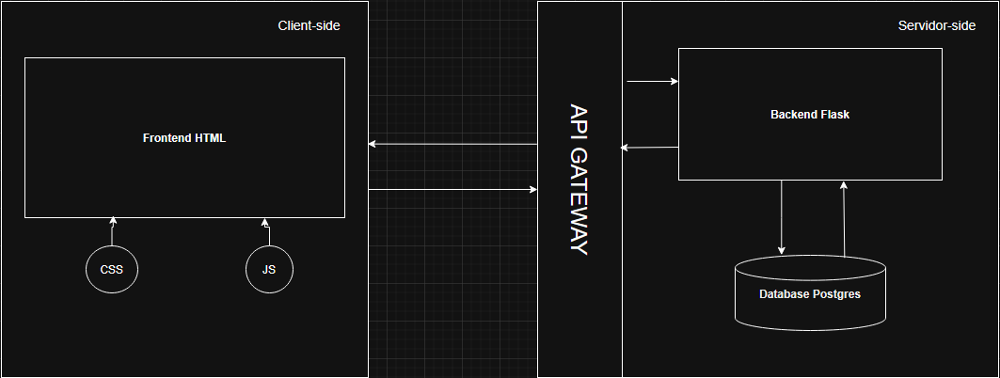

## 4. Projeto da Solução

## 4.1. Arquitetura da solução

### Arquitetura do Sistema

O diagrama a seguir representa a arquitetura de um sistema web dividido em duas camadas principais: **Client-side (lado do cliente)** e **Servidor-side (lado do servidor)**, conectadas por meio de um **API Gateway**, responsável por intermediar as requisições entre o frontend e o backend.

---

#### 1. Client-side

A camada do cliente é composta por:

- **Frontend HTML**: A interface do usuário é construída em HTML, sendo responsável pela estruturação do conteúdo apresentado ao usuário final.
- **CSS**: Utilizado para estilizar a interface, proporcionando uma experiência visual agradável e responsiva.
- **JavaScript (JS)**: Responsável pela interatividade da aplicação, permitindo a comunicação com o backend por meio de requisições assíncronas (AJAX/fetch), manipulação do DOM, validações, entre outras funcionalidades.

---

#### 2. API Gateway

O **API Gateway** atua como um intermediário que:

- Recebe as requisições do frontend.
- Direciona-as ao backend apropriado.
- Retorna as respostas ao cliente.

Além disso, pode aplicar políticas de segurança, controle de acesso, cache, e registro de logs, centralizando o tráfego entre as camadas.

---

#### 3. Servidor-side

A camada do servidor é composta por:

- **Backend Flask**: Aplicação desenvolvida com o microframework Flask (Python), responsável pela lógica de negócio, manipulação dos dados e respostas às requisições vindas do cliente.
- **Database Postgres**: Banco de dados relacional PostgreSQL utilizado para armazenamento persistente das informações do sistema, como dados de usuários, ingredientes, receitas, listas de compras, entre outros.

---

### Fluxo de Comunicação

1. O usuário interage com a interface HTML.
2. O JavaScript envia requisições HTTP para o API Gateway.
3. O gateway direciona as requisições para o backend Flask.
4. O backend processa os dados, realiza consultas ou atualizações no banco de dados Postgres.
5. O backend retorna a resposta ao gateway, que a envia de volta ao frontend.

---

> Essa arquitetura garante uma separação clara de responsabilidades, facilita a escalabilidade e manutenção do sistema, e proporciona uma base sólida para a adição de novas funcionalidades no futuro.
 
 **Diagrama de Arquitetura**:
 
 
 

### 4.2. Protótipos de telas

https://www.figma.com/design/rVo9G7BQDmsL9HOPxW7OCM/Untitled?node-id=0-1&m=dev&t=pvtHcDxqIq3pgddB-1

A Tela Inicial serve como ponto de entrada e navegação, atendendo aos requisitos de interface intuitiva (RNF-003) e responsividade (RNF-001).

A Tela de Relatório cumpre o RF-002 ao mostrar consumo e desperdício mensal, atendendo à história do usuário que deseja acompanhar seus hábitos alimentares. 

A Tela de Planejamento Semanal atende ao RF-001 e RF-009, permitindo a organização das refeições ao longo da semana, conforme solicitado na história de planejamento da alimentação.

A Tela de Criar Receita contribui para alimentar o sistema com novas opções e possibilita o controle de receitas pelo administrador (RF-004), ligada à história do ADM. 

As Telas de Receita Detalhada (ADM e comum) atendem ao RF-004, RF-006, RF-007 e RF-008, oferecendo visualização completa, impacto ambiental, filtros alimentares e opção de salvar, conforme as histórias de usuário ligadas a personalização e sustentabilidade.

A Tela de Login e Cadastro possibilita o acesso seguro e individual ao sistema, base para todas as histórias de usuários. 

A Lista de Compras cumpre o RF-005 ao gerar listas baseadas nas receitas, ajudando na organização das compras. 

A Lista de Itens realiza o RF-003 ao permitir o cadastro de ingredientes disponíveis, essencial para sugerir receitas com base nos itens em casa (RF-004), ligando a história do usuário que quer evitar desperdícios.

A Tela de Receitas Salvas facilita o acesso a receitas favoritas (RF-008). 

A Tela de Perfil reúne preferências alimentares e atalhos de uso (RF-007, RF-001).

Página Inicial ADM permite a moderação e gestão do conteúdo (RF-010), conforme a história do administrador que deseja manter o sistema organizado.


## Diagrama de Classes


## Modelo ER


### 4.3. Modelo de dados

#### 4.3.1 Modelo ER


#### 4.3.2 Esquema Relacional


#### 4.3.3 Modelo Físico

```
CREATE TABLE Ingrediente (
    id_ingrediente INT PRIMARY KEY,
    nome VARCHAR(100),
    quantidade FLOAT,
    unidadeDeMedida VARCHAR(50),
    impactoAmbiental FLOAT
);

CREATE TABLE Receita (
    id_receita INT PRIMARY KEY,
    nome VARCHAR(100),
    descricao TEXT,
    tempoPreparo DATETIME
);

CREATE TABLE Receita_Ingrediente (
    id_receita INT,
    id_ingrediente INT,
    PRIMARY KEY (id_receita, id_ingrediente),
    FOREIGN KEY (id_receita) REFERENCES Receita(id_receita),
    FOREIGN KEY (id_ingrediente) REFERENCES Ingrediente(id_ingrediente)
);

CREATE TABLE ListaCompras (
    id_lista INT PRIMARY KEY,
    valor FLOAT
);

CREATE TABLE ListaCompras_Ingrediente (
    id_lista INT,
    id_ingrediente INT,
    PRIMARY KEY (id_lista, id_ingrediente),
    FOREIGN KEY (id_lista) REFERENCES ListaCompras(id_lista),
    FOREIGN KEY (id_ingrediente) REFERENCES Ingrediente(id_ingrediente)
);

CREATE TABLE Usuario (
    usuario VARCHAR(18) PRIMARY KEY,
    senha VARCHAR(18),
    tipo ENUM('Cliente', 'Nutricionista')
);

CREATE TABLE Receita_Usuario (
    id_receita INT,
    usuario VARCHAR(18),
    PRIMARY KEY (id_receita, usuario),
    FOREIGN KEY (id_receita) REFERENCES Receita(id_receita),
    FOREIGN KEY (usuario) REFERENCES Usuario(usuario)
);

CREATE TABLE Cliente (
    id_cliente INT PRIMARY KEY,
    idade INT,
    nome VARCHAR(50),
    preferencias TEXT,
    usuario VARCHAR(18),
    FOREIGN KEY (usuario) REFERENCES Usuario(usuario)
);

CREATE TABLE Nutricionista (
    id_nutri INT PRIMARY KEY,
    nome VARCHAR(50),
    usuario VARCHAR(18),
    FOREIGN KEY (usuario) REFERENCES Usuario(usuario)
);

CREATE TABLE Nutricionista_Cliente (
    id_nutri INT,
    id_cliente INT,
    PRIMARY KEY (id_nutri, id_cliente),
    FOREIGN KEY (id_nutri) REFERENCES Nutricionista(id_nutri),
    FOREIGN KEY (id_cliente) REFERENCES Cliente(id_cliente)
);
```


### 4.4. Tecnologias


| **Dimensão**   | **Tecnologia**  |
| ---            | ---             |
| SGBD           | PostgreSQL           |
| Front end      | HTML+CSS+JS     |
| Back end       | Flask |
| Deploy         | Github Pages    |


```text
┌──────────────────────────────┐
│     Usuário no Navegador     │
└────────────┬─────────────────┘
             │
             ▼
┌──────────────────────────────┐
│ Interface Web (HTML/CSS/JS) │
│     hospedada no GitHub     │
│           Pages             │
└────────────┬─────────────────┘
             │
             ▼
┌──────────────────────────────┐
│      Requisição HTTP         │
└────────────┬─────────────────┘
             │
             ▼
┌──────────────────────────────┐
│     API Flask (Backend)      │
└────────────┬─────────────────┘
             │
             ▼
┌──────────────────────────────┐
│     SQLAlchemy (ORM)         │
└────────────┬─────────────────┘
             │
             ▼
┌──────────────────────────────┐
│ PostgreSQL (Banco de Dados)  │
└────────────┬─────────────────┘
             │
             ▼
┌──────────────────────────────┐
│  Resposta com dados (JSON)   │
└────────────┬─────────────────┘
             │
             ▼
┌──────────────────────────────┐
│ JS renderiza os dados na UI  │
└──────────────────────────────┘
```

